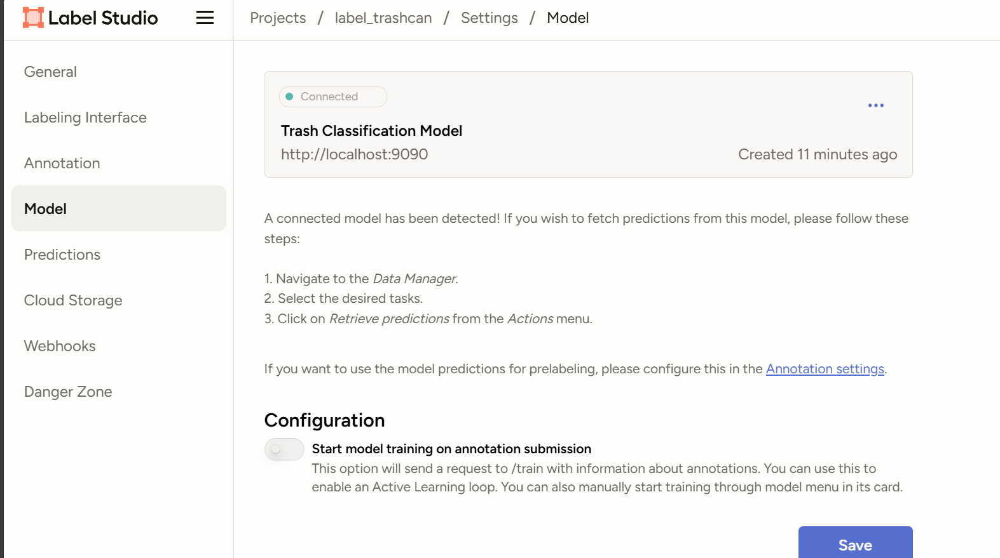
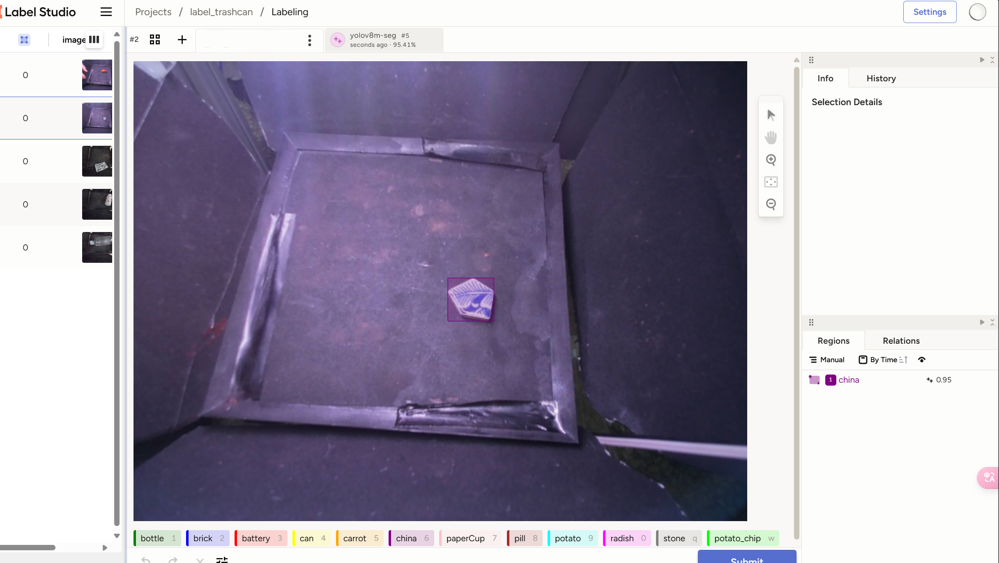

# Custom YOLO Backend for Label Studio

[👉 **Jump to Original Documentation**](#original-documentation)


A updated version of YOLO11 backend for Label Studio, forked from [seblful/label-studio-yolov8-backend](https://github.com/seblful/label-studio-yolov8-backend).

This backend provides ML-assisted labeling capabilities to accelerate your annotation workflow, supporting both **object detection** and **instance segmentation** tasks.

## 📦 Changes
- update the Dockerfile to avoid `app/start.sh` not found error
- update the Ultralytics to the latest version, supporting YOLO11 and earlier models
- a clearer and verified startup instruction

## 🚀 Quick Start

### Using Custom Models

1. Create and prepare your model directory:
```bash
mkdir model
cp /path/to/your/model.pt model/
mv model/your_model.pt model/best.pt
```

### Configuration

Edit `docker-compose.yml` with your settings:
```yaml
environment:
  - LABEL_STUDIO_URL=http://host.docker.internal:${PORT}
  - LABEL_STUDIO_API_KEY=your_api_key
  - TASK_TYPE=detection
```

> **Important Notes:**
> - Default LABEL_STUDIO_URL is `http://host.docker.internal:8080`
> - ⚠️ Never use `localhost` as the container is isolated from the host
> - Get your API_KEY from: Label Studio -> Account Settings -> Access Token

### 🇨🇳 For Users in China

To ensure smooth deployment in regions with internet restrictions:

1. Configure Docker daemon with proxy:
```json
{
  "registry-mirrors": ["https://registry.docker-cn.com"]
}
```

2. Deploy using the following commands:
```bash
docker pull pytorch/pytorch:2.3.0-cuda12.1-cudnn8-runtime
docker compose build
docker compose up
```

## 📸 Screenshots



*successfully connected model to Label Studio*



*example of the backend in action*

### 🎸 todo

add support for FastSAM and other YOLO-seg based models

---

## Original Documentation

*Below is the original documentation from the source project for reference.*

# YOLOv8 ML backend for the Label Studio

YOLOv8 interactive ML-assisted labeling, facilitating faster 
annotation for **image detection**, ***instance* image segmentation**.

Tested against Label Studio 1.13.1.

## Project Structure

- **Dockerfile**: The Dockerfile for building the backend container.

- **docker-compose.yml**: The docker-compose file for running the backend.

- **_wsgi.py**: WSGI app initializer.

- **start.sh**: bash script to start the whole process.

- **model.py**: The Python code for the ML backend model.

- **requirements.txt**: The list of Python dependencies for the backend.

## Setup process

Before you begin:
* Ensure git is installed
* Ensure Docker Compose is installed.


### 1. Install Label Studio

Launch Label Studio. You can follow the guide from the [official documentation](https://labelstud.io/guide/install.html) or use the following commands:


If you're using local file serving, be sure to [get a copy of the API token](https://labelstud.io/guide/user_account#Access-token) from
Label Studio to connect the model.

### 2. Create a Label Studio project

Create a new project.

In the project **Settings** set up the **Labeling Interface** for **image detection** (RectangleLabels) or **image segmentation** (PolygonLabels). 

### 3. Install label-studio-yolov8-backend

Download the Label Studio YOLOv8 backend repository.
   ```
   git clone https://github.com/seblful/label-studio-yolov8-backend.git
   cd label-studio-yolov8-backend
   ```

Configure parameters in `.env` file:

   ```
   LABEL_STUDIO_URL=<IPv4 Address> (check your ipconfig)
   LABEL_STUDIO_API_KEY=<Label Studio API token>
   TASK_TYPE=<segmentation> or <detection>
   ```

### 4. Start the servers

   ```
   docker compose up
   ```

### 5. Upload tasks

   Upload images directly to Label Studio using the Label Studio interface.


### 6. Add model in project settings

From the project settings, select the **Model** page and click [**Connect Model**](https://labelstud.io/guide/ml#Connect-the-model-to-Label-Studio).

   Add the URL `http://locallhost:9090` and save the model as an ML backend.

### 7. Label in interactive mode

To use this functionality, activate **Auto-Annotation** for drawing boxes.


## Training

Model training is **not included** in this project. This will probably be added later.

## Contributing

Contributions to this project are welcome. To contribute, please submit an issue or pull request.
